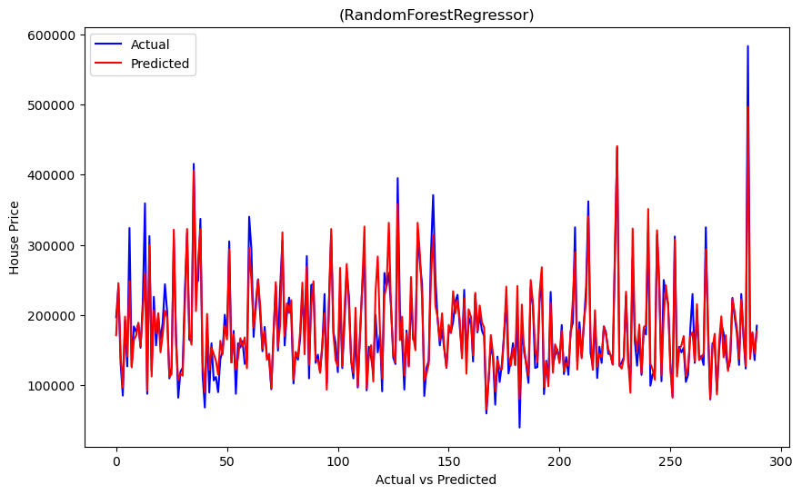
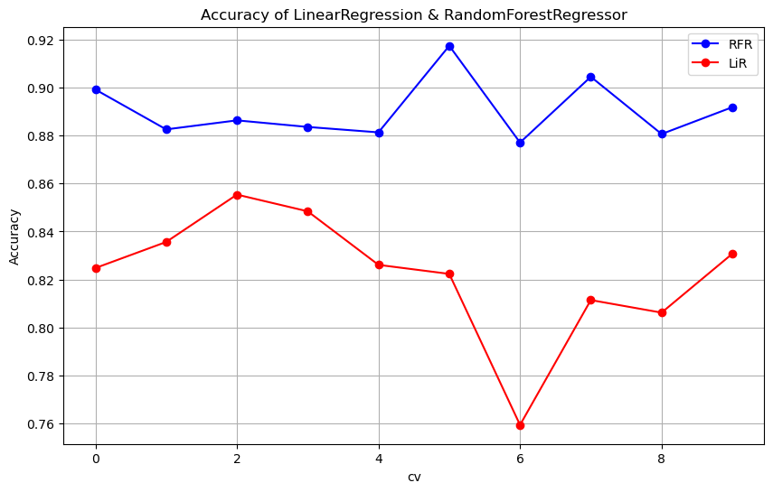
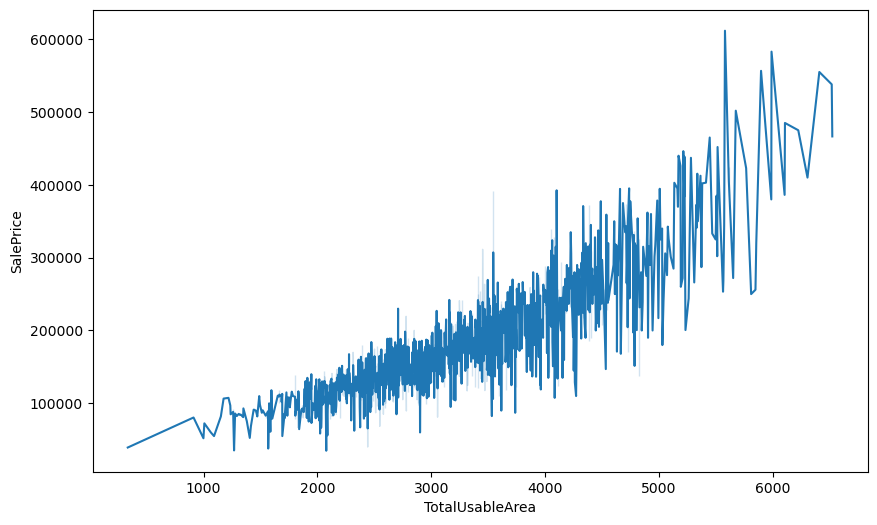
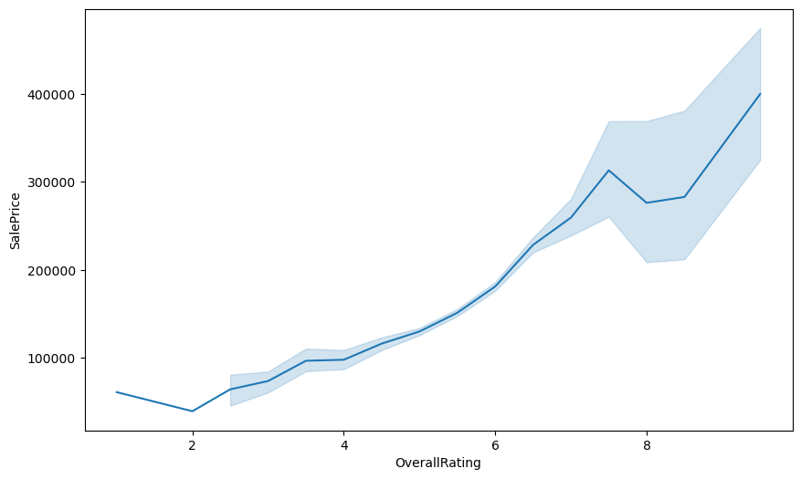
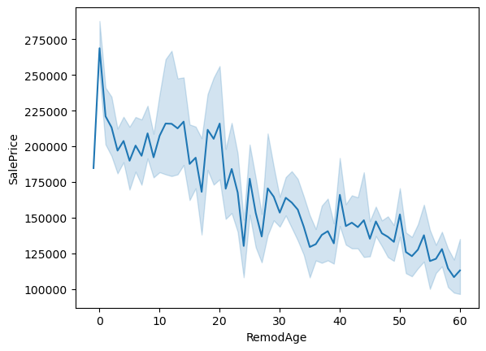

# House Price Prediction using Machine Learning

## Introduction
This project uses **machine learning** to predict *house prices* based on important features from the **Kaggle "House Prices - Advanced Regression Techniques" dataset**. The dataset contains **81 columns and 1460 entries**, providing detailed information about houses. 

We clean the data, extract useful features, and create new ones to improve accuracy. Then, we train models like **Linear Regression** and **Random Forest Regressor** to estimate the **sale price** of homes more effectively.

[**Machine learning Model**](https://house-price-prediction-model-b5xzmjn6vfhiovzn76mynz.streamlit.app/)

## Dataset Overview
- **Total Entries:** 1460
- **Columns:** 81 features
- **Target Variable:** SalePrice (House Price)
- **Features Include:**
    - Location (MSZoning, Neighborhood)
    - House characteristics (Rooms, Garage, Age, Renovation details)
    - Condition of the house (OverallRating)
    - Total usable area (TotalUsableArea)
    - Year of construction (YearBuilt)

## Data Preprocessing & Feature Engineering
- **Label Encoding:**
    - MSZoning
    - Neighborhood

- **New Columns Created:**
    - **TotalUsableArea:** Summation of all usable areas from multiple features like 1stFlrSF, 2ndFlrSF, TotalBsmtSF, etc. (Replaces LotArea for better utility)
    - **RemodAge:** Difference between YrSold and YearRemodAdd to capture remodeling age.
    - **OverallRating:** Constructed using OverallQual and OverallCond to represent overall quality and condition.
    - **TotalRms:** Based on the aggregation of multiple columns indicating number of rooms.

- **Dropped Columns:**
    - Columns with excessive missing values (e.g., Alley, PoolQC, MiscFeature)
    - ID and redundant features
    - Columns not contributing meaningfully to price prediction

Final Cleaned Dataset Saved As: **house_price_prediction_data_copy1.csv**

## Final Processed Dataset
After preprocessing, the dataset was reduced to only essential features:

| Column | Description | Preprocessing Steps |
|--------|------------|------------------|
| **MSZoning** | Location classification | Label Encoding |
| **Neighborhood** | Neighborhood classification | Label Encoding |
| **GarageCars** | Number of garages | Kept as-is |
| **TotalUsableArea** | Total usable house area | Created new column |
| **OverallRating** | Overall house quality & condition | OverallQual & OverallCond |
| **YearBuilt** | Construction year | Kept as-is |
| **RemodAge** | Time since renovation | Created new column |
| **TotalRms** | Total rooms count | Created new column |
| **SalePrice** | Final house price | Target Variable |

## Model Training & Evaluation

We trained two machine learning models:
1. Linear Regression
- Mean Absolute Error (MAE): ₹19,515.22
- Root Mean Squared Error (RMSE): ₹28,810.69
- R² Score: 0.83

2. Random Forest Regressor
- Mean Absolute Error (MAE): ₹14,065.32
- Root Mean Squared Error (RMSE): ₹21,272.72
- R² Score: 0.91

The Random Forest model performed best, achieving higher accuracy and lower error compared to Linear Regression.

## Key Insights from Data Analysis

**House prices strongly depend on:**

- Location-related features: **MSZoning**, **Neighborhood**
- Size and structure: **TotalUsableArea**, **GarageCars**, **TotalRms**
- House quality & condition: **OverallRating**
- Remodeling and construction history: **RemodAge**, **YearBuilt**
These features mirror real-world factors like area, number of rooms, and overall house condition that influence pricing.

## Conclusion Summary
This project demonstrates how choosing the right features based on real-world housing data, combined with simple and advanced machine learning models, can effectively predict house prices. By using clear and meaningful factors, the model not only achieves strong accuracy but also provides useful insights for making smarter real estate decisions..
## License

The dataset used in this project, [**House Prices - Advanced Regression Techniques**](https://www.kaggle.com/c/house-prices-advanced-regression-techniques/data), is sourced from **Kaggle** and is licensed under **Apache License 2.0**.
This license allows for free use, modification, and distribution, even for commercial purposes, as long as proper attribution is maintained.

